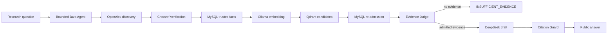

# ResearchPilot

[](https://github.com/DJ1012-H/research-pilot/actions/workflows/ci.yml)
[](https://adoptium.net/)
[](LICENSE)

ResearchPilot is a synchronous, controlled literature research agent. It plans
bounded searches, discovers papers through OpenAlex, verifies them with
Crossref, persists trusted facts in MySQL, retrieves candidates from Qdrant,
and produces citation-checked abstract-level answers through an
OpenAI-compatible model such as DeepSeek.

The central design rule is simple: models propose; Java validates and decides.
An empty or partial trusted result is preferable to an invented paper, answer,
or citation.

## Architecture



Four boundaries keep this flow controlled:

- The search Agent is a Java state machine with bounded rounds, refinement,
  deadlines, provider calls, and Crossref lookups.
- Only current `VERIFIED` papers with normalized DOIs can enter the trusted
  paper set. MySQL is authoritative; Redis and Qdrant cannot grant trust.
- Every vector hit is re-admitted through current MySQL state and a
  deterministic Segment content hash. Qdrant payload text is never answer
  evidence.
- Evidence IDs and citations must belong to the current request. Invalid model
  output fails closed; no admitted ABSTRACT means zero answer-model calls.

See the [architecture](docs/architecture.md) and the detailed
[design contracts](docs/design/) for the complete invariants.

## Current evidence

| Evidence | Result | Interpretation |
| --- | --- | --- |
| Java/Maven verification | 550 tests, 0 failures, 0 errors, 7 skipped | Deterministic offline suite; opt-in live tests are skipped |
| Frozen dataset | 24 bilingual cases: 12 tuning + 12 fixed holdout | Small repository-owner-audited corpus, not independent Ground Truth |
| Fixed-holdout retrieval | Recall@5 = 1.0, Hit@5 = 1.0, MRR = 1.0 | Every positive had reviewed evidence in the top five |
| Fixed-holdout refusal | 6/6 negatives refused | Includes five semantic negatives and one deterministic empty control |
| Fixed-holdout answer path | 4/6 positives succeeded | Two model-contract failures; overall holdout status is `FAIL` |
| Admission v2 development regression | admission 3/3, full answer 2/3 | Burned cases only; no independent acceptance authority |
| Targeted 2,000-token observation | one burned case succeeded with Judge=1, Answer=1, repair=0 | Diagnostic evidence only; historical `FAIL` results remain unchanged |

The project does **not** claim that RAG acceptance passed. The failed holdout
was preserved, diagnosed, and separated from later development regressions.
Read the [evaluation summary](docs/evaluation.md),
[fixed-holdout report](docs/demo/rag-v3-lite-day3-evaluation.md), and
[admission v2 repair record](docs/demo/rag-evidence-admission-v2-fix.md).
Frozen datasets and run evidence live on the repository's `eval` branch.

## Quick start

Prerequisites: Java 21 and the checked-in Maven Wrapper. The first build needs
Maven Central access unless dependencies are already cached.

Windows:

```powershell
.\mvnw.cmd -B -ntp clean verify
```

Linux or macOS:

```bash
./mvnw -B -ntp clean verify
```

The default configuration contacts no LLM, literature provider, database,
cache, embedding service, or vector store. `.env.example` documents optional
variables but is not loaded automatically.

For the equivalent scripted Windows entry point:

```powershell
powershell.exe -NoProfile -ExecutionPolicy Bypass -File `
  .\scripts\start-local.ps1 -Mode OfflineBuild
```

## Opt-in modes

| Mode | External dependencies | Purpose |
| --- | --- | --- |
| `TrustedSearch` | LLM, OpenAlex, Crossref | Live discovery and verification without persistence |
| `FullDemo` | TrustedSearch plus MySQL; optional Redis | Durable trusted-search evidence |
| `RagDemo` | LLM, MySQL, Ollama, Qdrant; optional Redis | Trusted RAG over existing verified papers |

All external integrations and RAG routes are disabled by default. The startup
script prompts for secrets without echoing or writing them. Index rebuilds,
database migrations, destructive recovery rehearsals, and paid model calls are
explicit operator actions. Follow the [runbook](docs/runbook.md).

## API

When a live mode is running:

- Swagger UI: <http://localhost:8080/swagger-ui.html>
- Dependency status: `GET /api/system/status`
- Trusted search: `POST /api/literature/search`
- Trusted retrieval diagnostics: `POST /api/research/retrieve`
- Trusted cited answer: `POST /api/research/ask`

`NO_VERIFIED_RESULTS`, `PARTIAL_SUCCESS`, and `INSUFFICIENT_EVIDENCE` are valid
business outcomes. Stable failure codes distinguish disabled features,
dependency failures, model failures, and contract validation failures.

## Repository map

- `src/main/java`: production Agent, provider, persistence, cache, and RAG code
- `src/test`: deterministic unit, contract, architecture, and H2 tests
- `docs/architecture.md`: component and trust-boundary overview
- `docs/evaluation.md`: dataset, metrics, failures, and evidence authority
- `docs/runbook.md`: offline and opt-in live execution
- `docs/design`: detailed implementation contracts and ADRs
- `docs/demo`: dated, redacted observations and historical acceptance evidence
- `scripts`: bounded startup, replay, evaluation, and recovery tools
- `infra`: local Qdrant Compose configuration
- `eval` branch: frozen evaluation datasets and result evidence

## Scope and limitations

ResearchPilot is an engineering demonstration over a small, domain-heavy
corpus. It is not a production SLA, independent academic benchmark, PDF or
full-text RAG system, frontend, asynchronous queue, or multi-Agent platform.
`CitationGuard` proves citation syntax, membership, and request ownership; it
does not prove semantic entailment or full-text factual correctness.

Never commit API keys, passwords, tokens, authorization headers, private hosts,
personal contact data, raw provider bodies, prompts, model drafts, cache keys,
or full abstracts. See `.env.example` for placeholders only.

Licensed under the [MIT License](LICENSE).
