# Architecture

ResearchPilot is a synchronous, controlled literature research agent. Java
owns workflow state, budgets, validation, trust decisions, persistence, and
public response assembly. Models propose bounded structured data; they do not
receive authority over tools or stored facts.

## End-to-end flow

```mermaid
flowchart LR
    Q["Research question"] --> A["Bounded Search Agent"]
    A --> O["OpenAlex candidates"]
    O --> C["Crossref verification"]
    C --> M["MySQL trusted facts"]
    M --> E["Ollama embedding"]
    E --> V["Qdrant candidate index"]
    V --> R["MySQL re-admission"]
    R --> J["Evidence relevance Judge"]
    J -->|"no admitted evidence"| N["INSUFFICIENT_EVIDENCE"]
    J -->|"admitted evidence"| D["DeepSeek answer draft"]
    D --> G["Java Citation Guard"]
    G --> P["Public answer and citations"]
```

## Authority map

| Component | Role | May establish trust? |
| --- | --- | --- |
| OpenAlex | Candidate discovery | No |
| Crossref | Independent bibliographic evidence | Contributes to Java verification |
| MySQL | Current paper, verification, Segment, and index-version facts | Yes |
| Redis | Short-lived cache of mapped provider results | No |
| Ollama | Query and document embeddings | No |
| Qdrant | Rebuildable similarity candidate index | No |
| DeepSeek | Search-plan, relevance, review, and answer drafts | No |
| Java validators | State transitions, budgets, schemas, admission, citations | Yes |

## Controlled search agent

The `LiteratureResearchAgent` is a Java state machine, not an unconstrained
tool loop. It permits at most two OpenAlex search rounds and one controlled
plan refinement. Search plans pass JSON syntax, JSON Schema, business, and
security validation before a provider is called. Candidate deduplication and
Crossref lookup budgets are enforced in Java.

Only formally eligible `VERIFIED` papers with normalized DOIs can enter the
public paper set or trusted persistence path. A partial or empty result is a
valid outcome; the agent never fills a response with unverified papers.

## Trusted RAG boundary

MySQL is authoritative and Qdrant is derived. Every vector hit is batch-read
from MySQL and rejected unless its DOI, verification version, source timestamp,
Segment coordinates, and deterministic content hash still match. Answer
evidence is reconstructed from current Java/MySQL data through
`RagDocumentBuilder`; Qdrant payload text is never used as answer evidence.

The relevance Judge receives at most five re-admitted candidates and returns a
closed JSON object containing only a relevance decision, current-request
evidence IDs, and a bounded reason. Java validates syntax, schema, DTO shape,
state consistency, uniqueness, and evidence ownership. Invalid or empty output
fails closed without a fallback parser or a second Judge call.

The answer model can cite only request-scoped IDs such as `P1`. Java validates
the answer draft and allows at most one controlled repair before
`CitationGuard` proves citation syntax, membership, and request ownership.
Public DOI, title, year, venue, and Segment metadata are assembled from trusted
evidence, not copied from the model.

## Failure semantics

- Redis failures bypass the cache and continue through the original provider
  and verification path.
- MySQL persistence failures fail closed when persistence is enabled.
- Ollama, Qdrant, active-version, re-admission, model, and validation failures
  have distinct stable codes.
- No admitted ABSTRACT evidence returns `INSUFFICIENT_EVIDENCE` with zero
  answer-model calls.
- RAG is disabled by default and does not alter the trusted-search endpoint.

Detailed contracts are under [`docs/design`](design/); dated observations are
under [`docs/demo`](demo/).
