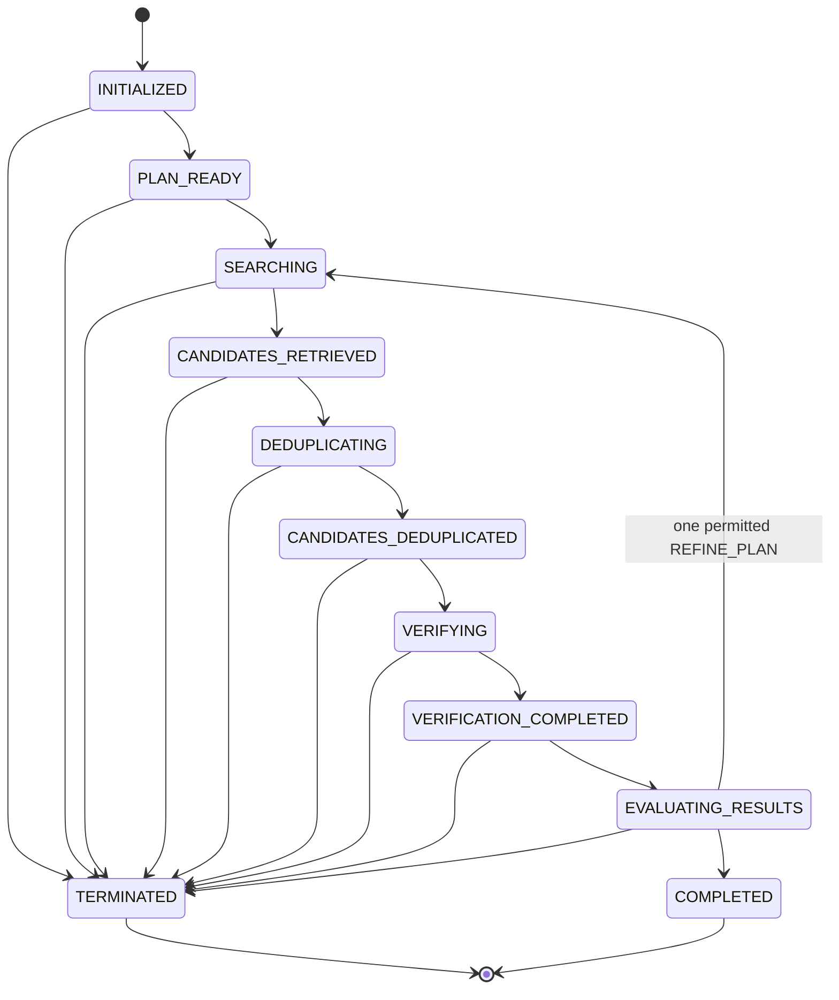
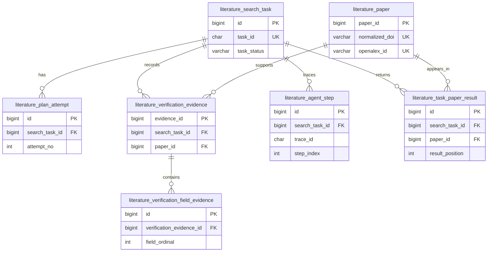
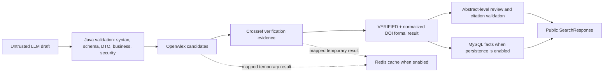

# Trusted Agent demonstration guide

This guide describes the code that exists in the current repository. It does not guarantee a particular public-network result. Use the focused offline script for deterministic evidence and label any manually run external request as a single **REAL NETWORK** observation.

## System architecture

```mermaid
flowchart LR
    Request["HTTP request"] --> Correlation["RequestCorrelationFilter"]
    Correlation --> Controller["LiteratureSearchController"]
    Controller --> Service["LiteratureSearchService"]
    Service --> Planner["SearchAgent"]
    Planner --> Agent["LiteratureResearchAgent"]
    Agent --> Actions["SearchActionDecider / SearchActionExecutor"]
    Actions --> OpenAlex["Cached OpenAlexSearchPort"]
    Actions --> Crossref["Cached CrossrefSearchPort"]
    Crossref --> Gate["VerificationPolicy / EligiblePaperFilter"]
    Gate --> Review["EvidenceReviewOrchestrator"]
    Review --> Persistence["Optional MySQL persistence"]
    Persistence --> Response["SearchResponse"]
```



The cache decorators are optional port-boundary optimizations. A hit does not bypass Crossref verification, the eligibility filter, or the formal-paper gate.

## Agent state model



The only repeated path is a Java-controlled second search round after at most one refinement. There is no free-form tool-calling loop, multi-Agent handoff, or hidden action type.

## Persistence ER model



The diagram follows Flyway V1/V2 foreign keys and unique constraints. Flyway is opt-in; H2 compatibility tests are useful regression evidence, not MySQL 8 acceptance.

## Trusted data flow



LLM drafts and provider responses are untrusted. Redis holds neither task facts nor verification decisions. The public response never exposes prompts, model drafts, raw provider JSON, cache keys, or full abstracts.

## Three paths to explain

1. **First round reaches the target.** The Agent completes after the first retrieval, deduplication, verification, and evaluation route. Formal output is still limited to verified DOI-bearing papers; a live request can differ because providers and the model are external.
2. **One controlled refinement.** If the first evaluation is insufficient and budget allows it, Java permits exactly one `REFINE_PLAN`. Explicit years and `limit` remain frozen, then at most one second search round occurs.
3. **Insufficient evidence or a boundary.** The response can be `PARTIAL_SUCCESS` or `NO_VERIFIED_RESULTS`; partially verified candidates never fill the `papers` list, no unsupported review is generated, and a budget/deadline termination makes no later external call.

Use the HTTP requests in `http/research-pilot.http` to illustrate the live interface. Do not claim that a particular request forces any path. For deterministic proof, run:

```powershell
powershell.exe -NoProfile -ExecutionPolicy Bypass -File .\scripts\verify-trusted-demo.ps1
```

That suite is **DETERMINISTIC TEST** evidence based on existing Mockito/fake/fixed-clock/H2 coverage. Existing provider snapshots are **OFFLINE FIXTURE** evidence. A manually configured serial run against LLM, OpenAlex, Crossref, MySQL, or Redis is **REAL NETWORK** evidence: record only redacted HTTP/business status, counts, review status, termination reason, and elapsed time, and call it an observation rather than an SLA, benchmark, or stability proof.
