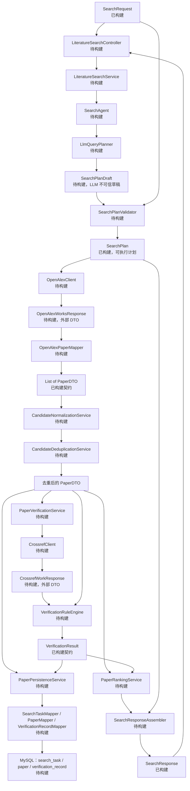

# 文献检索契约与类级数据流设计

## 1. 文档目的

本文档冻结 ResearchPilot 第一版文献检索功能的核心接口、数据含义、模块职责和依赖方向。

第一版接收一个自然语言研究主题，返回多篇同时满足“主题相关性”和“最低核验标准”的真实论文。后续开发应实现本文档中的接口，不应在接入 OpenAlex、Search Agent、Crossref 或数据库时临时改变核心字段含义。

## 2. 已确认的产品规则

- “近五年”包含当前年份；在 2026 年解析为 2022～2026。
- 请求中的 `fromYear`、`toYear`、`limit` 优先于从自然语言中推断出的限制。
- 第一版只执行一个主要 OpenAlex 检索式，先跑通单链路。
- Search Agent 只负责查询规划，不负责判断论文真假、去重或数据库写入。
- DOI、标题、作者、年份和期刊的比较由确定性 Java 规则完成。
- 搜索成功但没有候选通过核验时，返回 HTTP 200、`NO_VERIFIED_RESULTS` 和空论文列表。
- 默认不限制论文语言；英文检索式自然提高英文结果权重，只有用户明确指定语言时才设置语言过滤。
- 预印本可以进入候选池，但第一版不能进入正式结果；接入 DataCite/arXiv 核验后再评估放开。
- 候选论文允许暂时没有 DOI；进入最终正式结果的论文必须具有标准化 DOI 并达到最低核验标准。
- `PaperDTO` 只保存统一论文元数据，核验证据保存在独立的 `VerificationResult` 中。
- OpenAlex/Crossref 原始 JSON 后续单独缓存或入库，不能塞进 API DTO 或内部统一论文模型。

## 3. 分包策略

新功能采用“按业务分包、包内轻量分层”：

```text
literature
├─ api
│  └─ dto
├─ application
├─ model
└─ infrastructure
```

各层职责：

| 层 | 负责 | 禁止 |
|---|---|---|
| `api` | Controller、请求 DTO、响应 DTO、HTTP 参数校验 | 调用外部 API、Mapper 或实现去重规则 |
| `application` | 用例编排、Search Agent、计划校验、事务边界 | 保存外部 JSON 结构、实现 HTTP 细节 |
| `model` | 稳定的业务数据结构和枚举 | 依赖 Spring、MyBatis、LangChain4j 或外部响应 DTO |
| `infrastructure` | OpenAlex、Crossref、MySQL、Redis 等外部实现 | 将外部响应对象暴露给 Controller |

`application` 和 `infrastructure` 在对应开发日再创建，不提前增加空类。

## 4. 已冻结的五个核心契约

### 4.1 SearchRequest

包：`literature.api.dto`

| 字段 | 类型 | 必填 | 语义 |
|---|---|---:|---|
| `query` | `String` | 是 | 用户原始自然语言研究主题，最长 500 字符 |
| `fromYear` | `Integer` | 否 | 显式起始年份，优先于自然语言 |
| `toYear` | `Integer` | 否 | 显式结束年份，优先于自然语言 |
| `limit` | `Integer` | 否 | 希望最终返回的论文数，范围 1～50 |

默认值和 `fromYear <= toYear` 等跨字段规则由后续 `SearchPlanValidator` 处理。

### 4.2 SearchPlan

包：`literature.model`

`SearchPlan` 只表示“已经通过 Java 校验、可以直接执行”的计划，不表示 LLM 原始输出。

| 字段 | 类型 | 语义 |
|---|---|---|
| `originalQuery` | `String` | 保留用户原始问题，便于审计 |
| `topic` | `String` | LLM 解析出的规范化英文主题 |
| `englishKeywords` | `List<String>` | 英文关键词和同义词 |
| `searchQuery` | `String` | 第一版唯一的主要 OpenAlex 检索式 |
| `languages` | `List<String>` | ISO 语言代码；空列表表示不限制语言 |
| `publicationTypes` | `List<String>` | 允许的内部规范化文献类型；空列表表示不限制 |
| `fromYear` | `int` | 已解析并校验的起始年份 |
| `toYear` | `int` | 已解析并校验的结束年份 |
| `candidateLimit` | `int` | OpenAlex 候选池数量，1～100，且不小于 `resultLimit` |
| `resultLimit` | `int` | 最终期望返回数量，1～50 |

LLM 原始输出后续使用内部 `SearchPlanDraft` 表示。它必须经过 `SearchPlanValidator` 后才能生成 `SearchPlan`。

### 4.3 PaperDTO

包：`literature.model`

| 字段 | 类型 | 语义 |
|---|---|---|
| `openAlexId` | `String` | OpenAlex Work ID，使用 `W...` 形式 |
| `doi` | `String` | 标准化 DOI；候选阶段允许为空 |
| `title` | `String` | 论文标题，不能为空 |
| `authors` | `List<Author>` | 保持原作者顺序 |
| `publicationYear` | `Integer` | 展示年份，允许缺失 |
| `venue` | `String` | 期刊或会议名称 |
| `issns` | `List<String>` | 来源 ISSN，用于比期刊名称更可靠的核验 |
| `publicationType` | `String` | 内部规范化文献类型 |
| `landingPageUrl` | `String` | DOI 或来源落地页 |
| `abstractText` | `String` | 已还原的摘要文本 |
| `language` | `String` | 论文语言代码 |
| `keywords` | `List<String>` | 关键词或主题词，供相关性排序和后续 RAG 使用 |
| `citedByCount` | `int` | OpenAlex 被引次数快照，不能小于 0 |
| `source` | `LiteratureSource` | 候选检索来源，第一版为 `OPENALEX` |

`Author` 包含 `openAlexAuthorId`、`displayName`、`orcid`。数据库 Entity、OpenAlex 外部 DTO、Crossref 外部 DTO 都不能直接替代 `PaperDTO`。

### 4.4 VerificationResult

包：`literature.model`

| 字段 | 类型 | 语义 |
|---|---|---|
| `status` | `VerificationStatus` | 整体核验状态 |
| `evidenceScore` | `Double` | 0～1 的工程证据分，不表示统计概率；无法判断时为空 |
| `source` | `VerificationSource` | 第一版核验来源为 `CROSSREF` |
| `referenceDoi` | `String` | 核验源返回并标准化后的 DOI |
| `fieldResults` | `List<FieldVerification>` | DOI、标题、作者、年份、期刊等字段级结果 |
| `reasons` | `List<String>` | 可面向排障和用户解释的结论原因 |

整体状态：

- `NOT_CHECKED`：尚未核验。
- `VERIFIED`：核心身份和字段得到可靠支持。
- `PARTIALLY_VERIFIED`：核心身份成立，但存在可解释差异或非核心字段缺失。
- `CONFLICTED`：来源间存在明显且无法解释的冲突。
- `NOT_FOUND`：核验源未找到对应记录。
- `SOURCE_UNAVAILABLE`：核验源超时、限流或不可用。
- `REJECTED`：候选不满足相关性或最低核验规则。

`NOT_FOUND` 和 `SOURCE_UNAVAILABLE` 都不能被解释为“论文是假的”。

`PARTIALLY_VERIFIED` 进入正式结果的最低条件固定为：

1. 标准化 DOI 一致。
2. 标题达到后续规则引擎设定的高相似度门槛。
3. 至少第一作者一致。
4. 只允许出版年份存在可解释差异，或期刊字段缺失；其他核心字段冲突不能进入正式结果。

字段状态：

- `MATCHED`
- `EXPLAINABLE_DIFFERENCE`
- `MISMATCHED`
- `UNKNOWN`

### 4.5 SearchResponse

包：`literature.api.dto`

| 字段 | 类型 | 语义 |
|---|---|---|
| `taskId` | `UUID` | 本次检索任务公开标识 |
| `status` | `SearchStatus` | `COMPLETED`、`PARTIAL_SUCCESS` 或 `NO_VERIFIED_RESULTS` |
| `plan` | `SearchPlan` | 最终实际执行的计划 |
| `candidateCount` | `int` | OpenAlex 原始候选数量 |
| `deduplicatedCount` | `int` | 标准化和去重后的候选数量 |
| `verificationSummary` | `VerificationSummary` | 完全通过、部分通过、未完成核验、拒绝的数量 |
| `papers` | `List<PaperResult>` | 只包含允许进入正式输出的论文 |
| `message` | `String` | 本次检索结果说明 |
| `elapsedMs` | `long` | 总耗时 |
| `completedAt` | `Instant` | 完成时间 |

`VerificationSummary` 的四项数量总和必须等于 `deduplicatedCount`。

`PaperResult` 将三类信息组合在一起：

- `paper`：统一论文元数据。
- `relevanceScore`：0～1 的主题相关性工程分。
- `verification`：独立核验证据。

`PaperResult` 在构造时强制要求 DOI 非空，并且核验状态只能是 `VERIFIED` 或 `PARTIALLY_VERIFIED`，从数据结构层阻止未核验候选进入正式响应。

## 5. HTTP 接口契约

计划中的同步接口：

```http
POST /api/literature/search
Content-Type: application/json
```

请求示例：

```json
{
  "query": "近五年基于 Mamba 的遥感变化检测文章",
  "limit": 10
}
```

在 2026 年，上述“近五年”由 Java 解析为 2022～2026。若请求显式提供年份，则显式字段优先。

成功执行但没有合格论文时：

```json
{
  "taskId": "76efb6bf-bad6-46c8-a819-e44d35f24f0f",
  "status": "NO_VERIFIED_RESULTS",
  "plan": {
    "originalQuery": "近五年基于 Mamba 的遥感变化检测文章",
    "topic": "remote sensing change detection with Mamba",
    "englishKeywords": [
      "Mamba",
      "remote sensing change detection"
    ],
    "searchQuery": "Mamba remote sensing change detection",
    "languages": [
      "en"
    ],
    "publicationTypes": [
      "article",
      "review"
    ],
    "fromYear": 2022,
    "toYear": 2026,
    "candidateLimit": 20,
    "resultLimit": 10
  },
  "candidateCount": 20,
  "deduplicatedCount": 12,
  "verificationSummary": {
    "verifiedCount": 0,
    "partiallyVerifiedCount": 0,
    "unverifiedCount": 4,
    "rejectedCount": 8
  },
  "papers": [],
  "message": "未找到同时满足主题相关性和最低核验标准的论文",
  "elapsedMs": 1200,
  "completedAt": "2026-07-19T08:30:00Z"
}
```

参数错误和上游整体失败继续使用项目统一的 `ApiErrorResponse`。零结果不是 HTTP 错误，因为检索流程已经成功执行。

## 6. 从查询到返回的类级数据流

图例：

- **已构建**：本次已经落地并有测试覆盖。
- **待构建**：属于后续计划，不提前创建空实现。



## 7. 运行时顺序与模块责任

1. `LiteratureSearchController` 将 JSON 校验并转换为 `SearchRequest`。
2. `LiteratureSearchService` 创建任务标识并编排完整用例。
3. `SearchAgent` 通过 `LlmQueryPlanner` 生成内部 `SearchPlanDraft`。
4. `SearchPlanValidator` 解析相对年份、应用显式字段覆盖、限制数量并生成 `SearchPlan`。
5. `OpenAlexClient` 使用唯一主要检索式获取候选。
6. `OpenAlexPaperMapper` 将 OpenAlex 外部响应转换为 `PaperDTO`。
7. `CandidateNormalizationService` 统一 DOI、标题、作者、年份、期刊和 ISSN。
8. `CandidateDeduplicationService` 优先按标准化 DOI 去重；无 DOI 时按标准化标题去重。
9. `PaperVerificationService` 调用 `CrossrefClient`，优先 DOI 精确查询，必要时标题查询。
10. `VerificationRuleEngine` 比较字段并产生 `VerificationResult`。
11. `PaperPersistenceService` 保存任务、候选/正式论文和核验证据。
12. `PaperRankingService` 只对达到最低核验门槛的论文排序。
13. `SearchResponseAssembler` 将 `PaperDTO`、相关性分数和 `VerificationResult` 组合为 `SearchResponse.PaperResult`。
14. Controller 返回 `SearchResponse`。

如果零篇论文通过门槛，入库和响应组装仍正常完成，最终返回 `NO_VERIFIED_RESULTS`。Crossref 超时只能产生 `SOURCE_UNAVAILABLE`，不能推断论文不存在。

## 8. 依赖规则

- `api` 可以依赖 `application` 和 `model`。
- `application` 可以依赖 `model` 以及基础设施组件或端口接口。
- `infrastructure` 可以依赖 `model`。
- `model` 不依赖 Spring、MyBatis、LangChain4j 或外部 API DTO。
- Controller 不能直接调用 OpenAlex/Crossref Client 或 MyBatis Mapper。
- Search Agent 不能决定两篇论文是否合并，也不能决定核验规则是否通过。
- OpenAlex 和 Crossref 外部 DTO 只能留在各自的 `infrastructure` 子包。
- 数据库 Entity 与 API DTO 必须分离。
- `common` 只保存真正跨业务复用的错误响应和基础能力，不能成为杂物包。

## 9. 契约冻结规则

从本文档通过测试并确认后，07-20～07-25 的实现遵守以下规则：

1. 不删除、不重命名五个核心契约的现有字段。
2. 不改变字段已有语义、单位、空值含义和取值范围。
3. 外部 API 字段差异由 Mapper 吸收，不反向修改内部契约。
4. 数据库字段差异由 Entity/持久化映射吸收，不让 Entity 替代 DTO。
5. 新需求优先通过新增可选字段、枚举值或独立内部类型实现。
6. 若确实需要破坏性变更，必须先写 ADR，说明原因、影响和迁移方式。
7. `SearchPlanDraft`、外部响应 DTO、数据库 Entity 不属于公开 API 契约，可以在各自模块内部演进。
8. 默认语言策略、预印本准入策略和 `PARTIALLY_VERIFIED` 最低门槛属于已确认业务规则；实现类只能参数化阈值，不能改变规则含义。

## 10. 后续实现日程

| 日期 | 主要待构建类 |
|---|---|
| 07-20 | `OpenAlexClient`、外部 DTO、`OpenAlexPaperMapper` |
| 07-21 | `SearchAgent`、`LlmQueryPlanner`、`SearchPlanDraft`、`SearchPlanValidator` |
| 07-22 | Flyway 迁移、Entity、MyBatis Mapper、持久化服务 |
| 07-23 | `CrossrefClient`、外部 DTO、DOI/标题查询降级 |
| 07-24 | 标准化、去重、字段核验、规则引擎、排名 |
| 07-25 | Controller、完整编排服务、响应组装和集成测试 |

第三阶段的 RAG 只读取已核验并入库的论文，使用 `PaperDTO` 已冻结的标题、摘要、关键词和期刊信息。现有 `/api/chat` 后续迁移为基于这些已核验论文的 RAG 问答入口。
